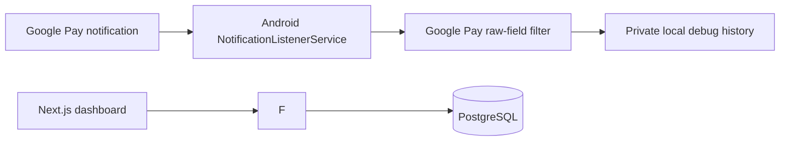

# Expense Diary

A personal expense diary with a local API and responsive web dashboard. The Android companion currently captures raw Google Pay notification fields on-device for format discovery. It uses notification access only; it does not scrape or automate the payment app.

## Architecture



The Android service captures notifications from Google's package and stores the latest raw fields in private local app preferences. It does not parse transactions or send them to the backend. The API independently deduplicates ingestion, assigns categories using database rules, and serves transaction and dashboard endpoints to the web app.

## Technologies

- Backend: Python, FastAPI, Pydantic v2, SQLAlchemy 2.x, Alembic, PostgreSQL, pytest
- Android: Kotlin, `NotificationListenerService`, private local notification history
- Web: Next.js App Router, TypeScript, Recharts
- Local database: PostgreSQL through Docker Compose

## Local setup

You need Python 3.11 or newer, Node.js 20.9 or newer, Docker with the Compose plugin, and Android Studio with JDK 17 and Android SDK 35 to build and run all three parts. The Android app can also use a physical device connected to the same private network as the backend.

### PostgreSQL

From the repository root, start the local database:

```sh
docker compose up -d db
```

The Compose configuration uses a development-only database and credentials. Copy `backend/.env.example` to `backend/.env` and set `DATABASE_URL` to the local PostgreSQL URL shown there. Do not reuse the sample database password outside local development.

### Backend

```sh
cd backend
python -m venv .venv
# Windows PowerShell:
.venv\Scripts\Activate.ps1
# macOS/Linux:
# source .venv/bin/activate
python -m pip install -r requirements.txt
Copy-Item .env.example .env   # PowerShell; use cp .env.example .env on macOS/Linux
alembic upgrade head
python -m uvicorn app.main:app --reload
```

The API is available at `http://127.0.0.1:8000`. Open `http://127.0.0.1:8000/docs` for interactive API documentation. The health endpoint is `GET /health`.

For a physical Android device, bind the backend to the local network interface with `python -m uvicorn app.main:app --host 0.0.0.0 --port 8000`. Keep the computer firewall enabled and use this only on a trusted private network; V1 has no authentication.

### Database migrations and tests

Run these commands from `backend/` with its virtual environment active:

```sh
alembic upgrade head
alembic current
pytest
```

The initial migrations create the transaction, category, and merchant-rule tables, then seed 11 default categories and 7 merchant rules. Tests use an isolated in-memory SQLite database and do not connect to or modify the development PostgreSQL database.

### Android companion

Open the `android/` directory in Android Studio, allow Gradle sync, and run the `app` configuration on an Android device or emulator. The project requires JDK 17 and SDK 35. The Android Gradle Plugin 8.8.x configuration pairs with Gradle 8.10.2; choose that Gradle version if the IDE asks for a local distribution ([official compatibility table](https://developer.android.com/build/releases/agp-8-8-0-release-notes)). The default debug API URL is `http://10.0.2.2:8000/`, which reaches the host computer from an Android emulator.

For a physical phone, set the Gradle project property `API_BASE_URL` to the computer's private LAN address, for example `http://192.168.1.20:8000/`. The debug manifest permits local cleartext HTTP for development; the main manifest disables it for release builds. Use HTTPS for any non-local deployment.

On the phone:

1. Install and open Expense Diary Companion.
2. Tap **Open Notification Access Settings** and enable access for Expense Diary Companion.
3. Return to the app. The screen shows whether access is enabled and the latest 10 captured Google Pay notifications.
4. Make a Google Pay payment and inspect Android Studio Logcat using the tag `ExpenseDiaryNotify`.

The app captures package name, title, text, big text, subtext, notification post time, and Android notification key. The raw snapshot is visible in the app and logged in debug builds. The local debug history is bounded to the latest 50 distinct callbacks. Transaction parsing and backend synchronization are not part of this milestone.

### Web dashboard

```sh
cd web
npm install
Copy-Item .env.local.example .env.local   # PowerShell; use cp on macOS/Linux
npm run dev
```

The dashboard runs at `http://localhost:3000`. `NEXT_PUBLIC_API_URL` defaults to `http://localhost:8000/api/v1`. The backend's explicit `CORS_ORIGINS` setting allows the two local dashboard origins; change it deliberately if you use another origin.

## API examples

Create a manual transaction:

```sh
curl -X POST http://127.0.0.1:8000/api/v1/transactions \
  -H 'Content-Type: application/json' \
  -d '{"amount":"420.00","currency":"INR","merchant":"Cafe Green","description":"Dinner","transaction_time":"2026-10-01T20:15:00+05:30"}'
```

Ingest a Google Pay notification event:

```sh
curl -X POST http://127.0.0.1:8000/api/v1/transactions/ingest \
  -H 'Content-Type: application/json' \
  -d '{"amount":"420.00","merchant":"Cafe Green","payment_app":"gpay","transaction_time":"2026-10-01T20:15:00+05:30","raw_notification":"₹420 paid to Cafe Green","raw_payload":{"packageName":"com.google.android.apps.nbu.paisa.user","text":"₹420 paid to Cafe Green"}}'
```

Other useful endpoints:

```text
GET    /api/v1/transactions?start_date=...&end_date=...&category=food&payment_app=gpay&limit=50&offset=0
GET    /api/v1/transactions/{id}
PATCH  /api/v1/transactions/{id}
DELETE /api/v1/transactions/{id}
GET    /api/v1/categories
POST   /api/v1/merchant-rules
GET    /api/v1/dashboard/summary?month=2026-10
GET    /api/v1/dashboard/monthly?month=2026-10
```

The ingest response contains a transaction and a `duplicate` flag. A duplicate retry returns HTTP 200; a new transaction returns HTTP 201. The `X-Duplicate` header mirrors that result. Reference IDs are checked first. When none is present, the backend hashes the payment app, amount, normalized merchant, transaction type, and timestamp rounded to a 10-second bucket.

## Privacy and security

- Android notification access is granted explicitly in Android settings. The app observes notifications only from Google Pay's package name; it does not use Accessibility Services, read private app storage, or automate a payment UI.
- Debug Logcat can contain payment notification content. Review it on your device and avoid sharing it publicly. Release builds do not emit these payload logs.
- The backend limits and filters the notification fields stored in `raw_payload`, truncates raw notification text, and omits those raw fields from normal transaction responses.
- The web client connects directly to the configured API. No third-party analytics or external font assets are loaded.
- V1 has no authentication and is intended for a trusted local network. Do not expose the API or database to the public internet. Add authentication before remote access.
- Keep real credentials in local environment files. `.env`, virtual environments, `node_modules`, and build output are ignored by Git.

## Known limitations

- Google Pay notification wording varies by device, Android version, and app release. The parser uses cautious text heuristics and may miss a transaction or merchant. Check the saved diary against your statements.
- Payment notes are not assumed to be present. The listener captures the available notification fields for inspection, but the current parser does not interpret notes or hashtags.
- Google Pay is the only implemented Android payment app. PhonePe and Paytm parsers are not included.
- CSV statement import, reconciliation, authentication, tags, and multi-user support are not implemented. The `statement_import` transaction source is reserved for a later CSV milestone; PDF OCR is out of scope.
- PostgreSQL requires Docker for the recommended local setup. The automated backend tests use SQLite as a separate, disposable test database.
